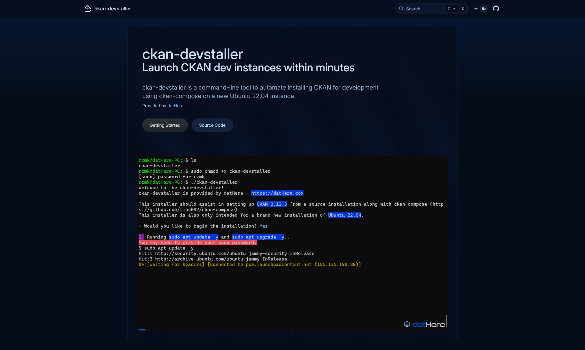

# ckan-devstaller docs website (ckan-devstaller.dathere.com)



This directory includes a Next.js project built with [Fumadocs](https://github.com/fuma-nama/fumadocs) for documentation of ckan-devstaller. The documentation can be viewed at [ckan-devstaller.dathere.com](https://ckan-devstaller.dathere.com).

We attempt to follow the [Divio documentation system](https://docs.divio.com/documentation-system/) which primarily includes:

- Tutorials
- How-to guides
- Explanation
- Reference

## Development

Run development server:

```bash
bun dev
```

Open http://localhost:3000 with your browser to see the result.

## Explore

In the project, you can see:

- `lib/source.ts`: Code for content source adapter, `loader()` provides the interface to access your content.
- `lib/layout.shared.tsx`: Shared options for layouts, optional but preferred to keep.

| Route                     | Description                                            |
| ------------------------- | ------------------------------------------------------ |
| `app/(home)`              | The route group for your landing page and other pages. |
| `app/docs`                | The documentation layout and pages.                    |
| `app/api/search/route.ts` | The Route Handler for search.                          |

## Linting

We use [Biome](https://biomejs.dev) for linting. We recommend you install the [biome-vscode extension](https://github.com/biomejs/biome-vscode) if you are using [VSCodium](https://vscodium.com/) or VSCode for developing the docs.
